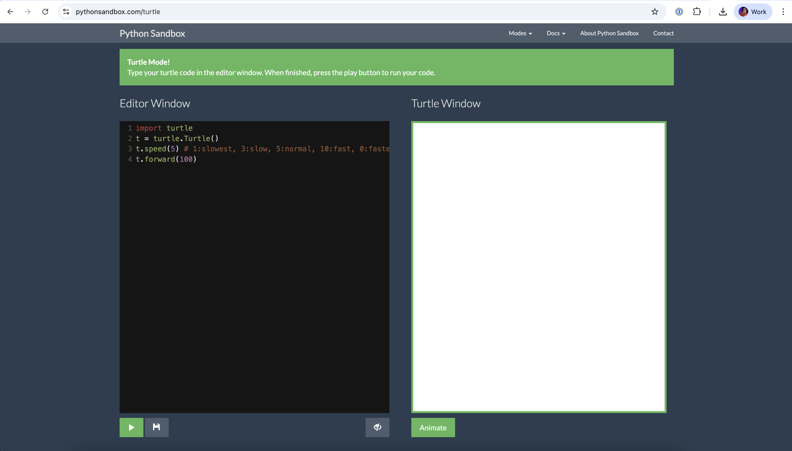

Let's get into our first bit of Python. Who's played with a spirograph before - drawing circles or lines over and over again to make pretty geometric patterns? 

We're going to learn how to Python by building our own simple script to make a shape.

Start by heading over to [Python Sandbox](https://pythonsandbox.com/turtle).



Let's start off by running the script that is already in there. It should look like this:

```python

import turtle
t = turtle.Turtle()
t.speed(5) # 1:slowest, 3:slow, 5:normal, 10:fast, 0:fastest
t.forward(100)

```

Let's step through what's happening:

At the top of our code we are importing the turtle library - this is telling your code to go get some extra stuff it needs to perform this task. Think of it like a library book, you wouldn't walk around school carrying every single book with you, its ineffecient and you'd get tired from carrying them. Instead, when you need the book for a subject you go and grab it. Today we need a book about turtles.

On line two, you’re creating a new turtle named `t`. Think of it like putting a turtle onto the screen that you can now give commands to (like move forward, turn, draw, etc). You could call this anything - maybe your turtle is named Elizabeth, or Myrtle. Everywhere else in your code that we talk about the turtle we need to include this name so we know who we're talking about.

Next we are defining the speed the turtle is going at. The text after the `#` is a little comment just for our eyes, the computer ignores it. Use this to talk to your friends or your future self to describe what you're doing or the expected behaviour.

Similarly on line 4 we are telling our turtle `t` to move forward with the value of `100`. Play around with making this more, or less, and see what happens. 

Let's add some more code below:

```python
for i in range(20):
    steps = int(200)
    angle = int(100)
    t.right(angle)
    t.fd(steps)
```

Press run, let's see what happens. 

Pretty right? You just wrote your first for loop - YAY TEAM. 

Let's break that down:

To kick it off we are starting a loop that runs 20 times. Each time the loop runs, the variable i increases from 0 to 19. Python uses indenting (spacing) to know what, specifically we want to loop through. In this case, the indented lines below it will happen once per loop, so the turtle will do the same set of actions 20 times.

A loop is SO POWERFUL because instead of writing out an instruction 20 times (so tedious) we can just say do this - loop through 20 times. Sorted. 

Next we need to know what we are asking of our turtle friend. 

```python
steps = int(200)
```
This sets the number of steps the turtle will move forward. We're storing the value 200 in a variable called steps. Using `int()` here is technically unnecessary since 200 is already an integer — but its a good practice to be in.

Can you guess what the next line is doing? We are creating a new variable called angle and storing the value 100 in it, just like the line above.

But with just those two lines nothing actually *happens*.

We need to call the function which is what's happening in our final two lines. We are saying t (our turtle) we want you to turn right the amount of degrees of our variable angle, and then we want to move forward the number in our variable steps. 

Now let's play with color - add the following line:

```python
t.color("pink")
```

Did it turn pink? Try moving the line to different points in your code running it again and seeing what happens. 


  
