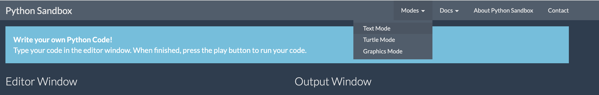

Hello World, this is me. Hello World is the most common starting point for any developer, dating all the way back to 1978!

Today we are going to do it in a couple of different ways.

Firstly, let's swap to text mode on Python Sandbox by selecting the Mode menu up the top, and toggling to `text mode`



Let's replace the current text with and press run.
```python 
print 'Hello World!'
```

The `print()` function tells Python to display something on the screen — usually in the terminal or console.

Think of it like telling Python:
🗣️ “Hey, show this message to the user!”

It's really handy for debugging to check if something is (or isn't!) getting called.

It can print text
```python
print("I love turtles!")
```
It can print numbers
```python
print(42)
```

It can print the result of a calculation
```python
print(5 + 3)
```

➡️ This will display: 8

It can print variables
```python
name = "Kate"
print(name)
```

➡️ This will show: Kate

And it can combine text and variables
```python
name = "Kate"
print("Hello, " + name + "!")
```

Let's jump back over to Turtle Mode and see if we can write Hello World another way!

Copy in the below, run it, and then let's talk through what's happening.

{}

Hint: the comments after the `#` are really helpful in describing what's happening

{}

```python
import turtle

# Set up the screen
screen = turtle.Screen()
screen.bgcolor("lightblue")

# Create a turtle
t = turtle.Turtle()
t.color("darkblue")
t.hideturtle()  # Hide the turtle icon
t.penup()       # Lift the pen so it doesn't draw lines

# Move to a good writing spot
t.goto(0, 200)    # You can change this to move text higher/lower

# Write the message
t.write("Hello, World!", align="center", font=("Arial", 24, "bold"))
```

Just like before we are importing our trusty turtle library, setting the scene (or screen) and making it a lovely shade of blue, and creating our turtle called t again, and making her dark blue.

Unlike last time, we are hiding her from view (GASP), and we don't want her to draw lines all over our page making it hard to read. Try switching to `pendown` and see what happens.

Next we are using the inbuilt function `goto` to move our invisible turtle to a spot on our page, and finally we are asking her to write us a message, using a bit of styling to make sure it looks the way we want. 

