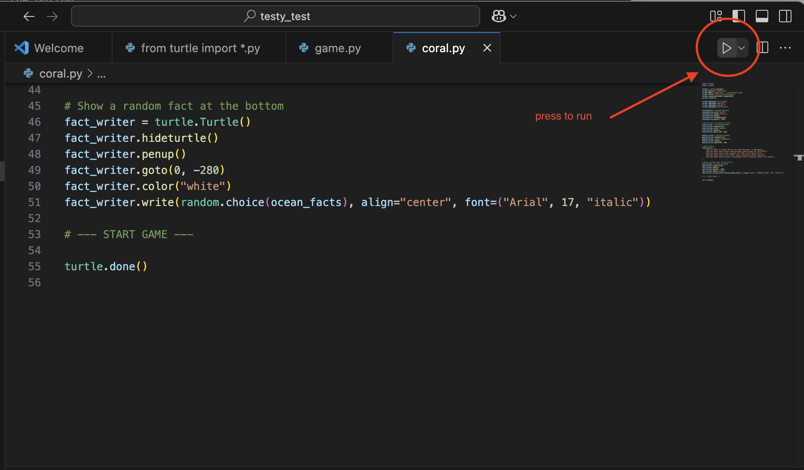

## Are you ready to build a game?

As a reminder we are building something that looks a bit like this:


To take some of the heavy lifting off, we've prepared some starter code for you that covers things like styling and basic setup so you can focus on the fun stuff - writing the code that pulls it all together.

Let's start off by opening VS Code. Next we want to go to Select File –> New File, and you should see your program window. It's always a great idea to save your project at the beginning of any new development, so let's do that now by hitting select File –> Save and name the file (I called mine game.py)

VS Code may ask if you want to install a Python extension, feel free to follow the prompts and do so.

Once you've got that in there, drop in this code.

```python

import turtle
import random

# --- SETUP ---
screen = turtle.Screen()
screen.bgcolor("lightblue")
screen.bgpic("image.gif")  # Background image
screen.title("Turtle Rescue Mission")
screen.setup(width=600, height=600)

# --- SCORE + HEALTH ---
score = 0
health = 3

score_writer = turtle.Turtle()
score_writer.hideturtle()
score_writer.color("white")
score_writer.penup()
score_writer.goto(-250, 260)

health_writer = turtle.Turtle()
health_writer.hideturtle()
health_writer.color("lightpink")
health_writer.penup()
health_writer.goto(150, 260)

# --- PLAYER TURTLE ---
rescueturtle = turtle.Turtle()
rescueturtle.shape("turtle")
rescueturtle.color("pink")
rescueturtle.penup()
rescueturtle.setheading(90)
rescueturtle.goto(0, -250)

# --- OCEAN OBJECTS ---
screen.addshape("coral.gif")
screen.addshape("bag.gif")
screen.addshape("can.gif")
screen.addshape("bottle.gif")

# --- OCEAN FACTS / MESSAGES ---
ocean_facts = [
    "Did you know? A plastic bottle can take 450 years to decompose.",
    "Did you know? Sea turtles often mistake plastic bags for jellyfish!",
    "Did you know? Coral reefs support over 25% of all marine life.",
    "Did you know? Only 9% of plastic ever produced has been recycled.",
    "Did you know? Every minute, one garbage truck of plastic enters our oceans.",
]

# --- FACT AT THE BOTTOM ---
fact_writer = turtle.Turtle()
fact_writer.hideturtle()
fact_writer.penup()
fact_writer.goto(0, -280)
fact_writer.color("white")
fact_writer.write(random.choice(ocean_facts), align="center", font=("Arial", 12, "italic"))

# --- START GAME ---

turtle.done()

```

We also want to download the following images so that they load when they're ready to be called. For Python to run it they need to be saved the right size and in a .gif format, so its best if you use these ones for now, but definitely play around later on to see what magic you can create.

1. [Coral](https://drive.google.com/file/d/1z3kMF-LzcYn-v_0o5EYVEvXELZDOHFu-/view?usp=sharing)
2. [Bag](https://drive.google.com/file/d/1XYkHb_R3bm3hxdnpTLozAffMExZqXVpo/view?usp=sharing)
3. [Bottle](https://drive.google.com/file/d/1cD8mdzK_nOrqOFJnqkP84JLOg4rrFtWx/view?usp=sharing)
4. [Can](https://drive.google.com/file/d/1M9vd1_bqZ7RZHUaMQMpr8eQDrVxBGoHh/view?usp=sharing)
5. [Background Image](https://drive.google.com/file/d/1lwwlrI5dgDCeT68EUN99Jv6QQdBtXxbX/view?usp=sharing)

Once you've downloaded them all, drag them into your workspace on VS code so you know they're in the same place as your turtle.

Let's run it and see what happens. We can run it by pressing this button



## Adding some movement in

Let's move that little turtle! Underneath your section about Ocean Facts drop in this segment of code

```python 
# --- MOVEMENT FUNCTIONS ---
def move_left():
    x = rescueturtle.xcor() - 40
    if x < -280:
        x = -280
    rescueturtle.setx(x)

def move_right():
    x = rescueturtle.xcor() + 40
    if x > 280:
        x = 280
    rescueturtle.setx(x)

# --- KEYBOARD BINDINGS ---
screen.listen()
screen.onkey(move_left, "Left")
screen.onkey(move_right, "Right")
```

So, what's happening here? We're starting off by making our first function. A function is a sequence of instructions that Python should execute. Each function in Python starts with the keyword `def`, is given a name, and can have some parameters. In this case we are making a function to `move left` and a function to `move right`. 

Let's go line by line
```
    x = rescueturtle.xcor() - 40
```

In this piece of code `rescueturtle.xcor()` gets the current x-coordinate of the turtle (remember your x and y axis from Math class?). We subtract 40 to move it 40 pixels to the left. This number is somewhat arbitary - you could increase or decrease it, but it may feel jumpy or glitchy. The new position is stored in the variable x.

```
    if x < -280:
        x = -280
```

This is a boundary check. If moving left would push the turtle off the screen, we reset x to -280, which is the left edge of the screen. This keeps our turtle visible and playable. If statements are really powerful - if this is true, do this thing. Later on we will see some if/else statements to unlock even more python power.

Finally we finish this block off by setting `rescueturtle.xcor()` to x to establish its new position on our game board.

We're repeating that with our `move_right` function so we can move in both directions, and then we make sure the code knows how to actually interpret what we are pressing. 

`screen.listen()` is telling our computer 'Hey wake up, it's important to notice when I'm pressing things!". Without this line, your code will completely ignore any buttons you may be pressing.

```
screen.onkey(move_left, "Left")
```

This line is saying 'When the Left Arrow key is pressed, run the move_left() function'. You could change this from "left" to "a" and see what happens. Similarly, we are repeating the logic for our `move_right' function.

Step 1 done, we've got a turtle who moves!!!